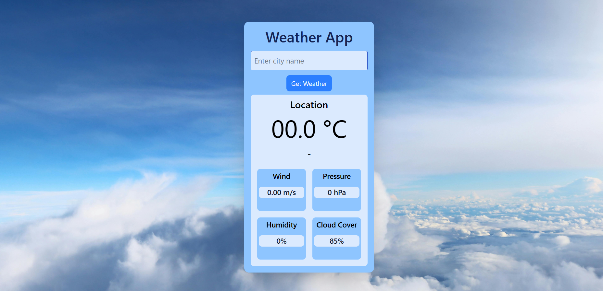

#  Weather App

This project is a web application that allows users to check the current weather of any city using the **OpenWeatherMap API**. It demonstrates the use of **HTML**, **Tailwind CSS**, and **JavaScript (Fetch API)** for creating an interactive and responsive user interface.

##  Live Demo

Experience the app in action here:  
 [weather-app-chi-jet.vercel.app](https://weather-app-chi-jet.vercel.app/)

##  Screenshot

##  Features

- Fetches current weather data from the **OpenWeatherMap API**.
- Responsive design for different screen sizes.
- Simple and clean user interface.

##  Technologies Used

- HTML
- Tailwind CSS
- JavaScript (Fetch API)
